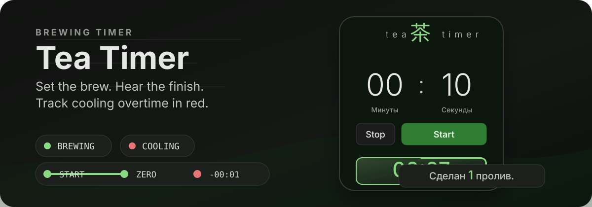

# Tea Timer

<p align="center">
  
</p>

<p align="center">
  <a href="https://my-tea-timer.vercel.app/"><strong>Open the live app</strong></a>
</p>

A compact, mobile-first timer for tea brewing. Set the duration with tactile drum controls, hear when steeping is complete, and track how long the tea has been cooling.

[](https://nextjs.org/)
[](https://react.dev/)
[](https://www.typescriptlang.org/)
[](https://tailwindcss.com/)
[](./LICENSE)

## Overview

Tea Timer is a small, touch-friendly brewing timer with a two-phase flow:

1. **Brewing**: the timer counts down from the selected duration.
2. **Cooling**: after zero, the timer keeps counting into negative time so you can see how long the tea has been waiting.

The interface is intentionally narrow and stable: the active timer keeps its place in the layout, and the elapsed time stays accurate when the tab is hidden or the device sleeps.

## Features

- **Drum pickers** for minutes and 10-second increments, controlled by swipe, drag, mouse wheel, or keyboard.
- **Two-phase progress** with a smooth brewing border, red negative-time display, and a three-minute cooling indicator.
- **Brew counter** with correct Russian plural forms; a brew is counted as soon as steeping reaches zero.
- **Tea wisdom dialog** with 315 shuffled quotes and a cooling reminder when tea has waited too long.
- **Persistent light and dark themes**, responsive layout, keyboard controls, and reduced-motion support.

## Timer Lifecycle

1. Choose a duration from `00:00` to `59:50`; `Start` remains disabled at zero.
2. During brewing, the timer uses an absolute end timestamp so returning to the tab restores the correct time.
3. At zero, the notification sounds, the brew counter increases, and cooling overtime begins.
4. `Stop` removes the active timer; stopping before zero does not increase the brew counter.
5. Starting another brew replaces the current cooling timer while preserving the completed-brew count.

## Tea Quotes

The quote button opens a native dialog and walks through a shuffled collection without repeats until the current cycle is exhausted. The collection contains **315 entries**, including 15 original phrases credited to **Сергей Шевелёв (Мой Чай)**.

While tea has been cooling for more than three minutes, the dialog replaces the next-quote action with the reminder `Ваш чай остывает...`.

## Tech Stack

- [Next.js](https://nextjs.org/) 16.2.4
- [React](https://react.dev/) 19.2.4
- [TypeScript](https://www.typescriptlang.org/)
- [Tailwind CSS](https://tailwindcss.com/) 4
- [Vercel Speed Insights](https://vercel.com/docs/speed-insights)

## Getting Started

```bash
npm ci
npm run dev
```

Open [http://localhost:3000](http://localhost:3000) in your browser.

## Scripts

```bash
npm run dev
npm run lint
npm run build
npm start
```

`npm run dev` starts Next.js with the webpack dev server.

## Project Structure

```text
app/
  components/
    DrumPicker.tsx          # Touch, wheel, and keyboard duration picker
    TeaSessionContext.tsx   # Shared cooling state
    TeaTimer.tsx            # Timer phases, progress, sound, and brew count
    TeaWisdom.tsx           # Shuffled quote dialog
    ThemeToggle.tsx         # Persistent light/dark theme control
  data/
    tea-quotes-popup-300.ru.json  # 315 attributed tea quotes
  globals.css               # Theme tokens, responsive layout, and motion
  layout.tsx                # Root metadata, theme initialization, insights
  page.tsx                  # Page shell, header, timer, and footer
assets/readme/
  hero.svg                  # GitHub README preview
public/
  notification.mp3          # Brewing completion sound
```

## Links

- HARDD LAB: https://hardd-lab.vercel.app/
- Telegram: https://t.me/hardd_lab
- GitHub: https://github.com/hardd23/tea-timer
- Demo: https://my-tea-timer.vercel.app/
- Tribute: https://web.tribute.tg/d/OyG

## Verification

Before publishing changes, run:

```bash
npm run lint
npm run build
git diff --check
```

The production build is deployed on Vercel and includes Vercel Speed Insights.

## License

The [MIT License](./LICENSE) applies to the source code.

Branding, logos, visual assets, and separately created content may have separate rights and attribution requirements. See [NOTICE.md](./NOTICE.md) for project credits and content attribution.
